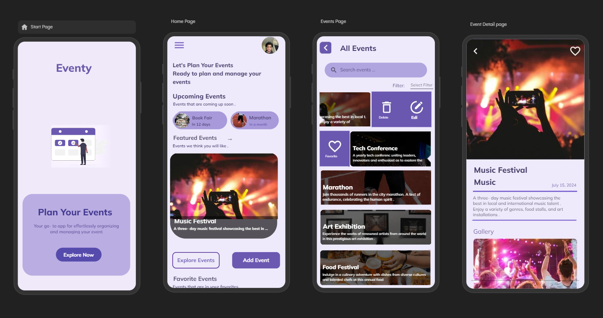

# Event Management .NET MAUI App

## Overview

Welcome to the Event Management .NET MAUI App! This application is designed to streamline event management processes, allowing users to create, manage, and track events seamlessly. The app leverages the power of .NET 7 and MAUI to deliver a cross-platform experience.

## Features

- **Event Creation**: Easily create new events with details such as name, date, location, and description.
- **Event Management**: View, edit, and delete existing events.
- **Attendee Tracking**: Keep track of attendees and their details.
- **Notifications**: Send notifications to attendees about event updates.

## Screenshots

Below is a landscape image showcasing three main screens of the app: Start Page, Home Page, Event List and Event Details.



## Prerequisites

To run this application, you will need the following dependencies:

- [.NET 7 SDK](https://dotnet.microsoft.com/download/dotnet/7.0)
- [Visual Studio 2022](https://visualstudio.microsoft.com/) with .NET MAUI workload installed

## Installation

1. **Clone the repository:**
   ```bash
   git clone https://github.com/your-repo/event-management-maui.git
   cd event-management-maui
   ```

2. **Restore NuGet packages:**
   ```bash
   dotnet restore
   ```

3. **Build the project:**
   ```bash
   dotnet build
   ```

## Running the App

### On Windows

1. **Open the solution in Visual Studio:**
   ```bash
   start EventyMaui.sln
   ```

2. **Set the startup project:**
   - Right-click on the `EventyMaui` project and select `Set as Startup Project`.

3. **Run the app:**
   - Press `F5` or click on the `Start` button to run the app.

### On macOS

1. **Open the solution in Visual Studio for Mac:**
   ```bash
   open EventyMaui.sln
   ```

2. **Set the startup project:**
   - Right-click on the `EventyMaui` project and select `Set as Startup Project`.

3. **Run the app:**
   - Press `⌘ + ↵` or click on the `Run` button to run the app.

## Usage

1. **Create a new event:**
   - Navigate to the `Event List` screen.
   - Click on the `Add Event` button.
   - Fill in the event details and click `Save`.

2. **Manage events:**
   - From the `Event List` screen, click on an event to view its details.
   - Edit or delete the event as needed.

 remove attendee details.

## Contributing

We welcome contributions! Please fork the repository and submit a pull request with your changes. For major changes, please open an issue first to discuss what you would like to change.

## License

This project is licensed under the MIT License. See the [LICENSE](LICENSE) file for more information.

## Contact

If you have any questions or suggestions, feel free to open an issue or contact us at [michael_ogunjimi@yahoo.com](mailto:michael_ogunjimi@yahoo.com).
